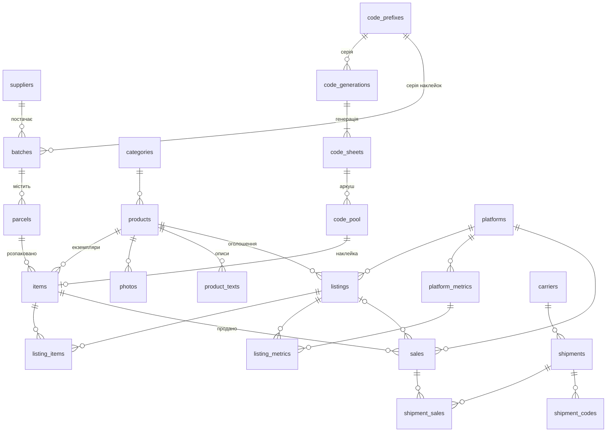

# Схема бази даних KI-BASE

Опис до `schema.sql` (поточний стан) і `migrations/001_init.sql` (перша міграція). Ціль — MariaDB 11.4 на хостингу, InnoDB, `utf8mb4` / `utf8mb4_uca1400_ai_ci`.

## Файли

| Файл | Призначення |
|---|---|
| `schema.sql` | Повна схема в поточному стані — довідка, «як є зараз» |
| `migrations/001_init.sql` | Перша міграція: початкова схема + запис у `schema_migrations` |
| `migrations/002_supplier_contacts.sql` | Контакт постачальника → телефон, e-mail, адреса, країна |
| `migrations/003_polish_ui.sql` | Інтерфейс польською: польські назви в довідниках; валюта Etsy — EUR |
| `migrations/004_code_prefixes.sql` | Префікси кодів наклейок: довідник, коди з 9 символів, префікс у аркушів і партій |
| `migrations/005_code_generations.sql` | Генерації кодів: аркуші, створені разом, групуються; наявні аркуші групуються автоматично |
| `seeds/001_reference_data.sql` | Довідники: платформи, їхні показники, перевізники (назви польською) |
| `SCHEMA.md` | Цей опис |

Кожна наступна зміна структури — новий файл `migrations/006_….sql`; `schema.sql` оновлюється разом із ним.

## Загальні принципи

- **Назви** — англійською, `snake_case`, таблиці в множині.
- **Гроші** — `DECIMAL(10,2)` + окреме поле валюти. Розрахункові поля у звітах — з 4 знаками, округлення робить інтерфейс.
- **Час.** Службові мітки (`created_at`, `updated_at`, `deleted_at`) — в UTC: застосунок на кожному з'єднанні виконує `SET time_zone = '+00:00'`. Облікові дати (`batch_date`, `sale_date`, `payout_date`) — календарна дата за польським часом.
- **Видалення.** Записи не видаляються фізично, заповнюється `deleted_at`. Виняток — службові таблиці (черги, спроби входу).
- **Хто зробив.** Основні таблиці мають `created_by`; усі зміни додатково пишуться в `activity_log`.
- **Статуси** зберігаються англійськими кодами (`ENUM`); польські підписи — в інтерфейсі.
- **Мова даних.** Назви категорій і довідників, назви й описи товарів у панелі — польською. Тексти оголошень — мовою платформи: Vinted, OLX, Facebook — польська, Etsy — англійська.

## Схема зв'язків

Основний ланцюжок: **партія → посилка → екземпляр → продаж → відправка**. Каталог товарів (`products`) стоїть осторонь: один товар об'єднує однакові екземпляри з різних посилок і партій.

Не показані на діаграмі, бо пов'язані з багатьма таблицями одразу: `comments`, `attachments`, `activity_log` (посилаються на будь-який запис через пару `entity_type` + `entity_id`), а також службові таблиці.

## Таблиці

### Закупівля

**`batches` — партії.** Дата партії (дата фактури; у формі за замовчуванням сьогодні), постачальник, номер фактури, ціни й кількість великих і малих посилок, **`total_paid`** — усе, що сплачено за партію, **`written_off_amount`** і **`written_off_parcels_count`** — посилки, які не вносяться в базу (залишили собі або вміст непридатний). Статус `open` / `closed`: у мобільній формі за замовчуванням пропонується остання відкрита партія. **`code_prefix_id`** — префікс наклейок цієї партії (у формі за замовчуванням — основний префікс); при розпаковуванні наклейка з іншим префіксом не приймається.

**`parcels` — посилки, внесені в базу.** Номер у партії (унікальний у межах партії), розмір `large` / `small`, ціна (копіюється з ціни партії для цього розміру, можна змінити), час розпакування. Списані посилки сюди не потрапляють — вони лише сума на партії.

**`suppliers` — постачальники:** назва, NIP (10 цифр), телефон, e-mail, адреса (вулиця з номером, поштовий індекс, місто, код країни ISO, за замовчуванням `PL`). Вільне поле контакту розділене на ці поля міграцією `002`.

### Каталог і екземпляри

**`products` — каталог: «що це таке».** Категорія, назва (розміри, ємність, довжина — частина назви), бренд, модель (обидва можуть бути порожні). Ідентифікація: статус `pending` → `draft` (заповнено ШІ) → `approved` (перевірено людиною), впевненість 0–100. Ринкова ціна **від / до**, валюта, стан, до якого стосується оцінка (`new` / `used`), дата оцінки й джерело. Запланована ціна продажу. Зв'язки з іншими товарами: `based_on_product_id` — опис узято за основу зі схожого товару; `merged_into_product_id` — чернетку приєднано до наявного однакового товару. Повнотекстовий індекс за назвою, брендом і моделлю — для пошуку схожих.

**`items` — фізичні екземпляри: один рядок = одна річ з наклейкою.** Код наклейки (унікальний), товар, **джерело** `parcel` / `own` / `purchase`, посилка (обов'язкова для `parcel`, заборонена для інших), **стан** `new_sealed` / `new_unsealed` / `used`, статус і час його зміни, ручна собівартість для власних речей.

Статуси екземпляра:

| Код | В інтерфейсі |
|---|---|
| `received` | Отримано |
| `identified` | Ідентифіковано |
| `priced` | Оцінено |
| `photographed` | Сфотографовано |
| `listed` | Виставлено |
| `sold` | Продано |
| `kept` | Залишено собі |
| `written_off` | Списано |

`kept` і `written_off` — для речей, які вже внесені в базу й пізніше вибули. Те, що відклали одразу при розпакуванні, у базу не вноситься взагалі.

**`code_prefixes` — префікси (серії) кодів.** Рівно дві великі латинські літери й опис; один активний префікс позначений як основний (за замовчуванням для нових партій і аркушів). Нумерація окрема для кожного префікса. Літери не змінюються, щойно з'явилися коди з цим префіксом; префікс не видаляється, а вимикається. `ZZ` зарезервовано для пробних друків.

**`code_generations` — генерації кодів.** Коди створюються наперед по 48–240 штук (1–5 аркушів A4) одного префікса; генерація — діапазон кодів, кількість, хто й коли. У панелі список аркушів показує генерації, а сторінка генерації — її аркуші сітками 6 × 8, як на папері.

**`code_sheets`, `code_pool` — наклейки.** Аркуші друкуються наперед, кожен аркуш належить генерації й одному префіксу; код — 9 символів: префікс + 6 цифр + контрольна цифра за алгоритмом Дамма, яка враховує й префікс (літери перетворюються на два знаки: A=10 … Z=35). На наклейці код показується групами: `KI 999 901 1`. Статус коду `free` / `assigned` / `spoiled`. Екземпляр посилається на код; присвоїти код, якого немає в пулі, база не дасть. При видаленні екземпляра код звільняється (поле стає порожнім).

**`photos` — фото.** Належать товару; якщо фото стосується конкретного екземпляра (пошкодження) — ще й екземпляру. Вид: `identification` / `sale` / `other`. Де лежить: `local` (шлях відносно сховища поза коренем сайту) або `cloud` (провайдер + ID файлу), мініатюра завжди на хостингу, `archived_at` — коли перенесено в хмару.

**`product_texts` — описи для продажу.** Заголовок, текст, теги для конкретної платформи й мови (або загальний текст мовою). Джерело `ai` / `manual`, хто й коли затвердив. Пишуться один раз на товар.

**`product_match_suggestions` — «схоже на цей товар».** Новий товар, кандидат, вердикт ШІ (`same` / `similar` / `different`), рішення людини: `merged` (той самий — приєднати), `used_as_base` (схожий — взяти опис за основу), `rejected`.

**`ai_jobs` — фонові завдання Claude API.** Тип (`identify` / `match` / `describe`), статус черги, модель, **токени й вартість** — щоб бачити, скільки коштує ідентифікація.

### Продаж

**`listings` — оголошення.** Товар, платформа, статус `draft` / `active` / `inactive` / `sold_out` / `closed`, опублікований текст, валюта, **початкова й поточна ціна**, кількість (для Etsy може бути більше 1), ID і посилання на платформі, службові мітки синхронізації.

**`listing_items` — які саме екземпляри пропонує оголошення** (зв'язок «багато до багатьох»: одна річ може бути одночасно на Vinted і OLX; одне оголошення Etsy може продавати кілька однакових речей).

**`platform_metrics`, `listing_metrics` — статистика оголошень.** Довідник показників кожної платформи з їхнім загальним змістом (`views` / `interest` / `cart` / `other`) і знімки значень із датою — видно динаміку.

**`sync_queue` — черга змін для платформ з API** (зараз лише Etsy). Обробляється cron'ом; статус `conflict` — зміна і в панелі, і на платформі, треба вирішити вручну.

**`sales` — продажі: один рядок = одна продана річ.** Дата, валюта, **фактична ціна продажу** й **ціна оголошення на момент продажу** (різниця — поступка при торгу), комісія платформи (0 — нормальне значення, напр. Vinted), країна покупця, номер замовлення, дата й сума виплати, курс NBP і його дата (для валютних продажів). Статус `completed` / `cancelled` / `returned`. База не дозволяє двох завершених продажів однієї речі; після повернення річ можна продати знову.

**`nbp_rates` — кеш курсів NBP.** Середній курс таблиці A; для продажу береться курс останнього робочого дня перед датою продажу.

**`shipments`, `shipment_sales`, `shipment_codes`, `carriers` — відправки.** Перевізник, послуга (пачкомат / кур'єр / пункт видачі), хто обрав спосіб, напрям (до покупця / повернення), вартість у злотих і хто платить, статус, дати. Одна відправка може містити кілька продажів; повернення — окрема відправка. Кодів у відправки може бути кілька різних типів. У перевізника — шаблон посилання для відстеження з `{code}`.

### Загальні

**`comments`** — довільна кількість коментарів до партії, посилки, товару, екземпляра, оголошення, продажу, відправки. Автор, час, закріплення. Нотатки, введені при створенні запису, зберігаються як **перший закріплений коментар**.

**`attachments`** — файли: фактури, етикетки, квитанції, скріни.

**`activity_log`** — журнал: хто, коли, що зробив, які поля змінились (старе / нове значення).

**`users`, `login_attempts`** — два акаунти без ролей; спроби входу — для захисту від підбору пароля.

**`tax_settings`** — форма оподаткування, ставка, чи платник ПДВ — з датою, з якої діє (зберігається історія).

**`app_settings`** — інші налаштування «ключ — значення».

**`integration_tokens`** — ключі доступу Etsy, OneDrive тощо, **зашифровані** ключем із локального конфігу (самого ключа в базі немає).

**`schema_migrations`** — які міграції вже застосовано.

## Собівартість і маржа

Розрахунки зроблені як **представлення (views)** — вони завжди актуальні й не потребують перерахунку.

**`v_item_costs` — собівартість екземпляра.**
- З посилки: ціна посилки / кількість екземплярів, внесених з цієї посилки (включно з тими, що потім `kept` чи `written_off`). Якщо щось з посилки не вносили, його частка автоматично лягає на решту.
- Власна річ: ручна собівартість або порожньо.

**`v_sale_financials` — продаж у злотих.** Виручка й комісія, перераховані за курсом NBP (для PLN курс = 1), поступка, частка вартості доставки, яку платили ми (вартість відправки ділиться порівну між її продажами), собівартість, джерело. Якщо для валютного продажу ще немає курсу — суми порожні, а `rate_missing = 1`.

**`v_batch_summary` — підсумок партії.**
- `entered_parcels_cost` — сума цін внесених посилок; `unallocated_amount` = сплачено − списано − внесені посилки. Поки партію розпаковують, це просто ще не внесені посилки; після закриття партії має бути 0 — інакше десь помилка у введенні.
- Кількість екземплярів: усього / продано / залишено собі / списано / в наявності.
- **Маржа = виручка − комісії − доставка, яку платили ми − уся сума, сплачена за партію.** Рахується від повної суми партії (разом зі списаним), а не від суми собівартостей. Доставка враховується й для повернених продажів — ці гроші реально витрачені.
- `sales_missing_rate` — скільки продажів не враховано, бо немає курсу.

Власні речі до маржі партій не потрапляють за визначенням — у них немає партії.

**Перевірка на тестових даних** (партія: сплачено 500, списано 30; дві внесені посилки — 30 зл. на 5 речей і 15 зл. на 3 речі):

| Що | Результат |
|---|---|
| Собівартість речей з першої посилки | 6,00 |
| Собівартість речей з другої посилки | 5,00 |
| Продаж 20 EUR за курсом 4,2567, комісія 2 EUR | виручка 85,13, комісія 8,51 |
| Продаж 10 EUR без курсу | не врахований, `sales_missing_rate = 1` |
| Відправка 12 зл. на два продажі + повернення 10 зл. | доставка 6 + 6 + 10 = 22 |
| Маржа партії | 175,13 − 8,51 − 22 − 500 = −355,38 |

Від'ємна маржа тут нормальна: продано лише 4 речі з 8 внесених, а більшість посилок партії ще не розпаковано.

## Контроль цілісності в самій базі

База відхиляє, незалежно від коду панелі:

- другий завершений продаж тієї самої речі;
- екземпляр із джерелом `parcel` без посилки, або власну річ, прив'язану до посилки;
- код наклейки не у форматі «2 літери + 7 цифр» або код, якого немає в пулі;
- два основні префікси або основний префікс вимкнений;
- той самий код на двох екземплярах;
- дві посилки з однаковим номером у партії;
- списану суму більшу за сплачену;
- ринкову ціну «від» більшу за «до»; впевненість більше 100.

## Як розгорнути на хостингу

1. cPanel → «Бази даних MySQL»: створити базу й користувача, дати користувачу всі права на цю базу.
2. phpMyAdmin → вибрати базу → «Операції» → колація `utf8mb4_uca1400_ai_ci`.
3. «Імпорт» → `migrations/001_init.sql`, потім `seeds/001_reference_data.sql`.
4. Перевірити: у базі 33 таблиці й 4 представлення, у `schema_migrations` — рядок `001_init`.

Схему перевірено на MariaDB 10.11 (та сама колація й синтаксис): завантаження, тестові дані, усі обмеження, а також відновлення з дампу.

## Що треба врахувати далі

- **Категорії** порожні — наповнюються в панелі.
- **Валюти платформ:** Etsy — EUR, Vinted / OLX / Facebook — PLN. **OLX, Facebook:** хто платить комісію — не задано.
- **Посилання відстеження** перевізників узяті за відомими форматами — перевірити при першому реальному використанні.
- **Бекап бази:** `mysqldump` пише в представлення `DEFINER` з ім'ям користувача бази. При відновленні під іншим користувачем (інший хостинг, локальна копія) це дає помилку прав — скрипт бекапу має прибирати `DEFINER` із дампу.
- **Власні речі й податки** — схему обліку узгодити з бухгалтером; поле `source` уже дозволяє виключати або виділяти їх у звітах.
